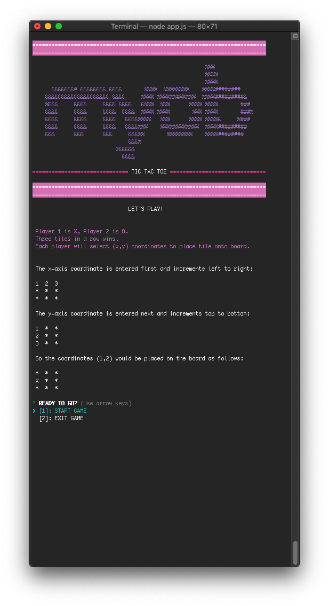
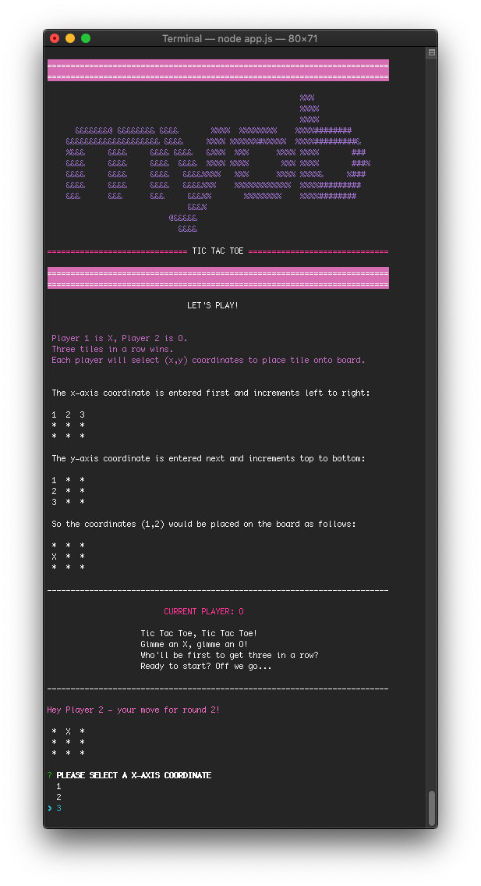
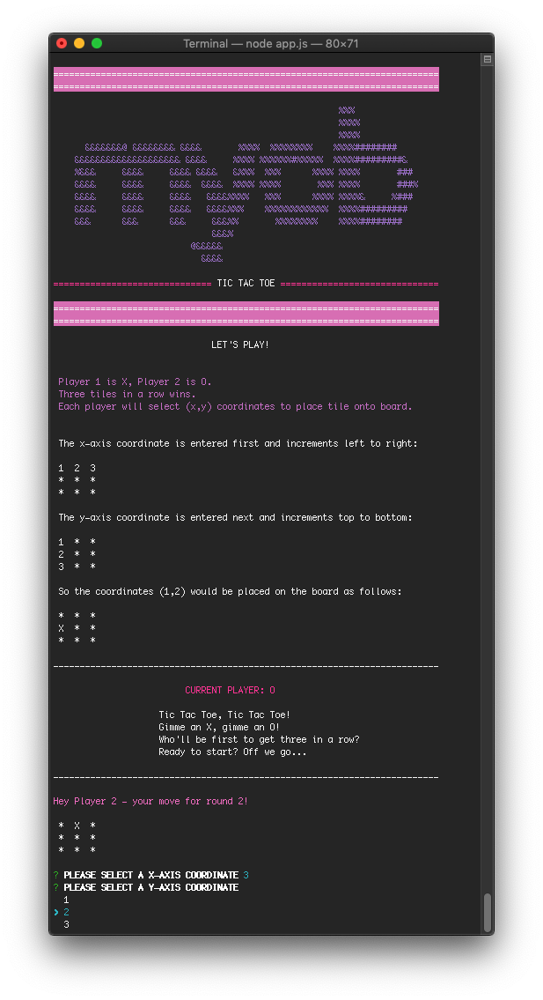
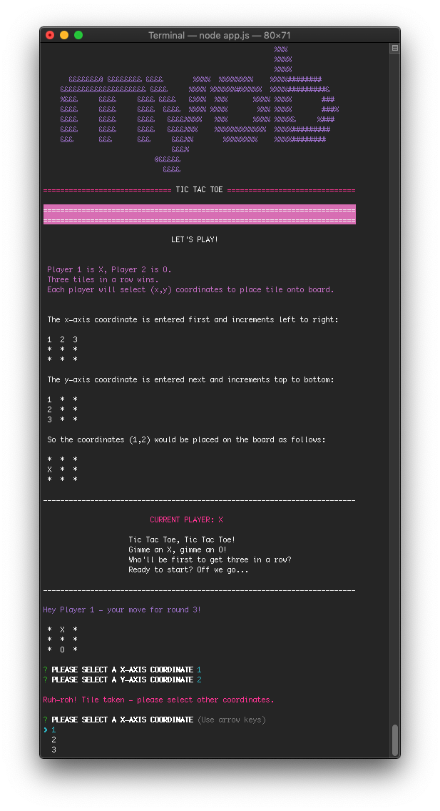
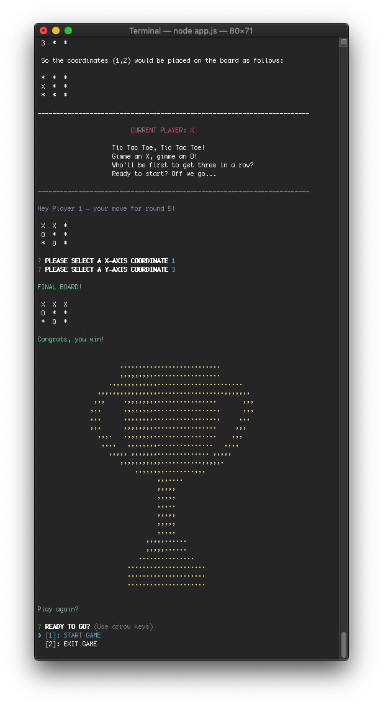
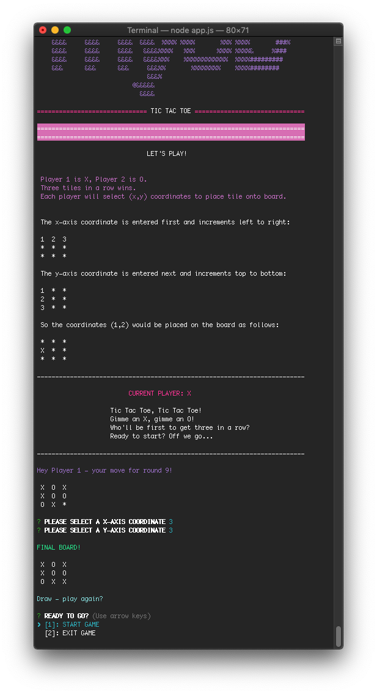
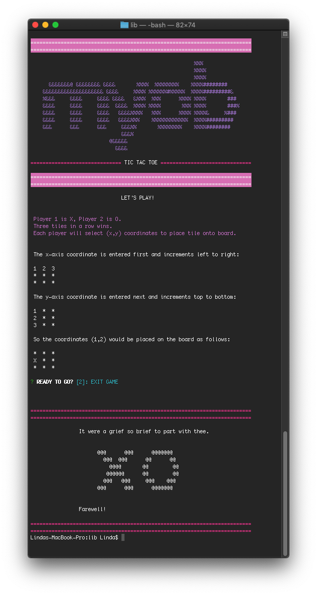

# Yay, Tic Tac Toe!
A CLI application of the ol' classic Tic Tac Toe for MYOB's Future Makers Academy.

## Getting Started
### Installation
* Windows or Mac OSX
* Node v10.14.1

In the console, follow the instructions below to install requirements and dependencies required for the application.

1. Install a package manager for Windows via the PowerShell console or Mac OSX via the Terminal console:

  For Windows, install [Chocolatey](https://chocolatey.org/install):
```
Set-ExecutionPolicy Bypass -Scope Process -Force; iex ((New-Object System.Net.WebClient).DownloadString('https://chocolatey.org/install.ps1'))
```

  For Mac OSX, install [Homebrew](https://brew.sh/):
```
mkdir homebrew && curl -L https://github.com/Homebrew/brew/tarball/master | tar xz --strip 1 -C homebrew
```

2. Install a Node version management utility to install the specific version of Node used above:

  For Windows, install [nvm-windows](https://github.com/coreybutler/nvm-windows):
```
choco install nvm
```

  For Mac OSX, install [nvm](https://github.com/nvm-sh/nvm):
```
curl -o- https://raw.githubusercontent.com/nvm-sh/nvm/v0.34.0/install.sh | bash
```

3. Install Node version 10.14.1 using nvm:
```
nvm install v10.14.1
nvm use v10.14.1
```

4. Clone the GitHub repository and change directory into `TicTacToe`:
```
git clone https://github.com/linda-lai/TicTacToe.git
```
Then, `cd TicTacToe`.

5. Install the dependencies listed in `package.json` via npm (Node Package Manager, included as part of Node):
```
npm install
```

### Launching
#### Game
To start Tic Tac Toe, change directories into `/lib` folder:
```
cd lib
```

In the `/lib` folder, enter `node app.js` to initialise.

Off we go!

#### Tests
To run tests, in the root or lib folder, enter:
```
npm test
```

### UI Instructions
1. Initialise the application by entering `node app.js` in the console. The main menu will appear as below, prompting the user to opt to start the game or to exit the application. Use the `up`/`down` arrows or `1` or `2` keys to navigate through the options and select `Enter`.

    To start the game, select `1` with the `up`/`down` arrows or `1` key and select `Enter`.
    
    Player 1 is designated with the `X` marker while Player 2 is designated with the `O` marker.


2. Player 1 (`X`) will be prompted to select a coordinate for the X-axis, then the Y-axis. Use the `up`/`down` arrows or `1`, `2` or `3` keys to navigate through the options and select `Enter`. The board will place Player 1's marker on the tile with the corresponding coordinates and display.


3. Next, Player 2 (`O`) will be prompted to select a coordinate for the X-axis, then Y-axis. Use the `up`/`down` arrows or `1`, `2` or `3` keys to navigate through the options and select `Enter`. The board will place Player 2's marker on the tile with the corresponding coordinates and display.




4. The application will throw an error if the marker has already been placed on the board.


5. The game will continue to toggle between each player until each player has had two turns. On the fifth round the game will start to check for a winner. If three identical markers are placed consecutively either horizontally across a row, vertically across a column or diagonally, the player the marker belongs to will be the winner!


6. After nine turns, if all the board tiles have been filled without three consecutive markers horizontally, vertically or diagonally, the game is a draw.
    


7. Win or draw, the players are then given the option to play again or exit the application.


## Requirements
* https://github.com/linda-lai/TicTacToe/blob/master/CHALLENGE.md
* https://github.com/MYOB-Technology/FMA-Application-Coding-Problem

## Discussion
Having just over a week to do the coding challenge while working full-time proved to be a blessing in disguise, as it forced me to be very deliberate in distilling requirements and my focus to the essentials. In the long run, this stopped me from over-engineering my solution while also thinking carefully and thoughtfully about efficiencies and trade-offs within and beyond the scope of this challenge. I deliberately tried to timebox my analysis and implementation so that I had a clear finish line in place and not fall down an rabbit hole of endless development.

I decided to use JavaScript as it's a language I've worked with most recently and am most comfortable with. Being more familiar with JavaScript in the front-end, using Node in the console was an interesting challenge and learning opportunity that pushed me to grapple more fully with its asynchronous nature and really think about why my code was behaving the way it did.

### Dependencies
As much as possible, I always try to use libraries minimally in order to produce an application that is simple and lightweight. Being a junior dev, I believe this enhances my learning as it compelled me to break down and step through the problem more granularly, and to think carefully about when and if an external library was a helper rather than a hindrance/bloat. A continual consideration of mine is the trade-off between efficiency and readability, both in terms of my code (for other developers, and myself in the future) and for the UI/user experience (for players).

My decision-making around the libraries I did end up using were based on how to keep my code and UI readable, consistent and clean, with the questions I asked myself being:

> Why should I use it?

> Why should I not use it?

> Is this making my application simpler or more complex?

For linting, **ESLint** was used to enforce code consistency while **Chalk** was used to style the UI. I used **Jest** for unit testing and mocking data/functions, which proved to a steep learning curve. I opted not to use Node's inbuilt readline module and use **Inquirer** instead to manage user inputs as I prefer a promise-based approach over callbacks where possible as this provides a better developer user experience, and inbuilt functionality for validation, parsing, prompting and error feedback.

### Application Design Decisions
Keeping the FMA brief's guideline to 'write the best code possible', many times throughout development, my decision-making wavered between keeping the application as clean, efficient and simple as possible and balancing my available time for refactoring and current skills/knowledge. As a junior dev, my desire to follow best practices and produce clean code and well-engineered solutions can often lead to paralysis analysis: *ahhhhh, what about tech debt?!*


My learning approach involves a continual push and pull between getting it done, and wanting (but not necessarily knowing) how to do things 'right' or 'perfectly' (if such a concept even exists). Discovering the conscious competence matrix has been a helpful mental model for capturing my feelings about my learning process as a developer - I'm constantly vacillating between feelings of cluelessness, growing pains and euphoria when it comes to my current skills and knowledge! For now, somewhere between the yellow and green square is the *'comfortable with feeling uncomfortable space'* I tend to occupy as I navigate the early stages of my career.


> All code is technical debt.

> Done is better than perfect.

As I've practiced, I've come to better understand how to actually start, and learn how to improve from there, and the concepts above have guided my approach to problem-solving as a junior developer. I've accepted that being a developer means embracing change and uncertainty and accepting that all code is technical debt - every time I learn a better way of doing things (which is what should be happening), it makes all the code I've written in the past suboptimal.

> Clean code always looks like it was written by someone who cares.

However, as a junior dev continually building on my level of knowledge around firstly, how to do something, then how to do that something well, I've focused on demonstrating a high level of quality and care in the areas that I know I can do well, and to be honest and own the parts that haven't been done well or could be done better (usually either due to lack of time or current knowledge), and welcome feedback and teaching in the many areas I'm not sure about - rather than forcing myself to try and understand everything all at once.

I've realised that it's most important/helpful for me (and others teaching/working with me) to:
- Explain my thinking, opinions and code choices with colleagues and mentors to gauge my understanding;
- Listen to my instincts, common sense, gut feeling or general 'code smells' around practices that feel inherently right or wrong;
- Give things a go, ask lots of questions and continually welcome feedback and mentoring;
- Code reviews, code reviews, code reviews!


#### Modules/Functions
Being new to software development design principles and patterns, I've found functional programming to be a really helpful approach, as getting started I try to break down then build towards a particular output or function, and then piece them each componnent together.

With this in mind, my approach focused on following the below code principles as much as possible:
* **DRY**: Don't Repeat Yourself - creating functions that could be repeatedly invoked rather than writing similar lines of code.
* **KISS**: Keep It Simple Stupid - creating clean, simple, readable and consistent code and interface, trying to keep functions lean and small.
* **Maintainability**: Using descriptive and meaningful naming conventions, consistent styling and creating readable and extendable code friendly to other developers.

As much as possible, I wrote functions to only do or return one thing, deal only with a specific set of information or always produce the same output for the same arguments - each had specific responsibilities or could be reused repeatedly throughout the application. Any time code needed to be reused, it was moved to a separate function addressing this responsibility. Throughout this assignment, this separation to make my code as reusable as possible became more granular, with the trade-off between time and refactoring being a continual consideration.

| Module                | Responsibility                                  
|:---------------------:|:----------------------------------------------------------------------:|
| `app`                 | To initialise or quit the main game application       
| `game`                | Manages the game logic and conditions for user inputs and wins/draws                   
| `helpers`             | Helper functions and variables for UI styling and formatting

### Game Play
Deciding how to manage inputs, validations and the conditional logic for the game in a way that was both efficient and explicit/readable proved to be one of the most interesting challenges in building my application - throughout the week, I tried to timebox my analysis and approach for implementing each part of the core functionality, keeping an eye out for any code smells or opportunities for refactoring down the line.

#### User Inputs
One of the advantages of using the Inquirer package to manage user inputs from the console was the ability to use the `up`/`down` and `1`, `2`, `3` keys to navigate to a selection before pressing `Enter` - it does not need a specific input to be captured that then needs to be validated. This meant that I could define both the data type and a range of data options to be selected rather than inputted. Since the range of coordinates was `1`, `2` or `3`, I opted to use numbers as strings for defining the list selections for both the main menu options (`1` to start, `2` to exit) and the coordinate options for the x-axis and y-axis. While I try to avoid using magic strings as much as possible, it felt acceptable/necessary in this instance as the coordinates needed to be concatenated, I could control the data types and range in on my end, and the range was small/manageable.

#### Conditions
For the win logic and loops, I tried to keep this relatively lean and efficient by avoiding deeply nested conditions and terminating iterative loops as early as possible when conditions had been met - for example, setting the loop to only start checking for wins after the fifth round (i.e. after both players have had two turns and after which it would be possible for the next tile placed to be a winning combination). While overall I'm happy with the mentality and logic behind my approach, given more time I would have liked to have further refactored my `checkWin()` and `updateGameBoard()` functions further as in my mind they are still doing too much.

#### Error Handling
Due to the advantages of using the Inquirer package to render a list of selections rather than capturing a specific input that needed to be validated myself, this meant I could control and define the data type and range of selections within my application so that error handlers did not need to be created for invalid inputs (i.e. checking the data type or if the coordinates given were outside the range of the 3 x 3 board). Players can use both the `up`/`down` and `1`/`2`/`3` keys to move through the different selections.

Because of this design, the main/only error handler required was if a tile had already been taken by another player, thereby minimising the potential for players to force errors when running the app.

## Challenges
### Challenge 1: Asynchronous JavaScript
An interesting (and occasionally maddening!) challenge for this assignment was coming to terms with the asynchronous nature of Node - being more familiar with JavaScript in the DOM with friendly helpers like state management and web APIs to aid with managing the flow of data and functions forced me to think in more abstract/programmatic terms about why JavaScript behaves as it does, and the overall data and function flow without the immediate visual feedback that frontend provides.


Using Node, I've come to appreciate how promises and async/await have helped to improve developer user experience, though fully grasping the concept and implementation of both still represents an ongoing learning process. One of the biggest learning curves, pain points and eventual win for me was figuring out how to stitch my functions together using these (and so, so many console.logs!).

In future, I would like to  implement a less manual approach to stepping through my functions and application flow by learning how to utilise debugging tools.

### Challenge 2: Testing
Until recently, I'd had limited exposure to testing or Test Driven Development from my recent work experience or education so I welcome the impetus to further build up my competence in this area, particularly as unit testing seems naturally suited to functional programming, and the importance of testing in the overall software development cycle.

While I aimed to implement a TDD approach to my solution, trying to do this while learning about testing and using Jest proved to be too much of a impediment and made it difficult to find a way to start or make progress. Past experience taught me to start and do what I could to get some early wins and to timebox my analysis/attempts to keep up my momentum and sense of progress. While there were points where I attempted to refactor my code to make them easier to test, it required passing 4+ arguments to it, and seemed to add unnecessary layers of complexity that did not make my code functionally better or more readable.

Rather than continuing down a path of resistance, I tried to follow the principles behind it since I couldn't do the practice: writing out my steps in pseudocode, getting a working function up as quickly as I could, use `console.log` throughout my application repeatedly to get feedback, and refactoring the function to do/return only one thing. Being able to further experiment with Jest syntax and matchers writing some basic tests, I walked away with a much stronger understanding of what I should test through the development of my application (albeit perhaps not how) and appreciation for how it compels you to refactor and simplify your code.

Moving forward, I would love to spend more time outside of this challenge learning about testing given the steep learning curve I've felt when it comes to implementing unit/integration testing on more complex functions and data calls. However, this experience has reinforced to me how tests make your code more robust and modular, and importance of testing in production/real-life for reliability and scalability.

### Challenge 3: UX/UI
One of the most fun aspects of the challenge was styling the UI. Building up the visual elements to be rendered also enabled me to better visualise and think through the overall application flow. The simplicity of the console display enabled me to be creative about how and where I could inject some colour and personality into the application through the output whilst also giving users meaningful feedback, using styling where I could to highlight useful information and provide some kind of visual hierarchy.

## Future Enhancements and Improvements
Overall while I'm happy with my application's core functionality, as always there are improvements I'd be itching to implement further down the line. However, I felt it was important to timebox my implementation and force myself to be very deliberate and focused on the core requirements to deliver the simplest but most efficient/elegant solution I could, lest I fall into a vicious refactoring cycle and over-engineer my application with no clear end in sight.

I'd like to use the code review as an opportunity to understand what I did well/could improve before implementing further improvements or changes, either within my code or the CLI display.

* **Testing**: Being such an important aspect of the software development cycle, I'd love to learn how to implement more (and better) tests. When trying to test my application, the difficulty of doing this for more complex functions signalled to me that some further refactoring was required to simplify this, or more sophisticated testing methods like mocks. After my submission has been evaluated, it is something I would definitely like to work on implementing further after additional refactoring given my understanding of Jest and the design of my application.
* **Navigation**: Implementing further navigation options for players to improve the user experience - currently they do not have an option to exit the application while selecting coordinates and can only do so when a win or draw has been completed.
* **Design Patterns**: Learning more about functional and object-orientated design patterns and principles to enhance my understanding and decision-making about the benefits and trade-offs of different design approaches, and to train my brain to think about my approach to coding more in those terms.

## Assumptions
* Users would be familiar with the rules and game play of Tic Tac Toe.
* Users would know how to exit the application (either when a win/draw is completed or using `Control` + `C`).
* The player can follow the instructions/guide in the application header to understand how x-axis coordinates and y-axis coordinates are mapped on a 3 x 3 board.

## Conclusion
Overall, I'm happy with what I was able to achieve completing this challenge in terms of the final state of the code and the UI. Being able to get a complete solution up and running is a huge win, and to me, the first step to everything. In future, I would focus on refactoring my code further, getting better at testing and learning about different application design approached I could've taken (such as an object-orientated).

Each time I have an opportunity to complete a challenge like this I'll get better and better at it. Something imperfect but complete is better than something 'perfect' but unfinished, and it's important to me that I always aim to submit something regardless so that I can get feedback, as I believe personal goals (not just the final outcome) are an extremely important and healthy perspective to take on these things.

I would absolutely love any feedback or advice about what was done well/could be done better so that I can continue to improve and learn as much as possible.

Thanks for taking the time to review my code/submission and for the challenge, I truly enjoyed it!